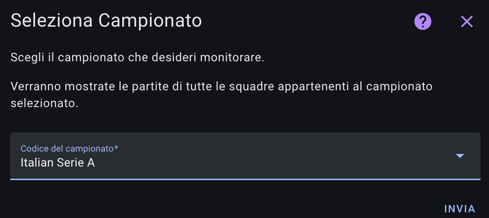

# Calcio Live - Home Assistant Integration

## Supportami / Support Me

Se ti piace il mio lavoro e vuoi che continui nello sviluppo delle card, puoi offrirmi un caffè.\
If you like my work and want me to continue developing the cards, you can buy me a coffee.


[](https://www.paypal.com/donate/?hosted_button_id=Z6KY9V6BBZ4BN)

Non dimenticare di seguirmi sui social:\
Don't forget to follow me on social media:

[](https://www.tiktok.com/@silviosmartalexa)

[](https://www.instagram.com/silviosmartalexa)

[](https://www.youtube.com/@silviosmartalexa)


## Video Guida / Video Guide

[Guarda il video su YouTube](https://www.youtube.com/watch?v=K-FAJmwsGXs)\
[Watch the video on YouTube](https://www.youtube.com/watch?v=K-FAJmwsGXs)

## Descrizione / Description

L'integrazione "Calcio Live" per Home Assistant permette di ottenere informazioni in tempo reale sulle competizioni di calcio, come classifiche, cannonieri e giornate di campionato.\
The "Calcio Live" integration for Home Assistant allows you to get real-time information about football competitions, such as standings, top scorers, and matchdays.
    


## Installazione manuale tramite HACS / Manual Installation via HACS

1. ## 📦 Installation simple
[](https://my.home-assistant.io/redirect/hacs_repository/?owner=bobsilvio&repository=calcio-live&category=integration)


2. Vai su Impostazioni > Integrazione > Aggiungi Integrazione e cerca 'Calcio-Live'.\
   Go to Settings > Integration > Add Integration and search for 'Calcio-Live'.

3. Configura l'integrazione tramite l'interfaccia di Home Assistant.\
   Configure the integration via the Home Assistant interface.


### NOTA / NOTE: !!!! NON DIMENTICARE IL PUNTO 7 - LE CARD VANNO INSTALLATE A PARTE COME PUNTO 1 e 2!!!!

!!! DON'T FORGET POINT 7 - THE CARDS MUST BE INSTALLED SEPARATELY AS IN POINTS 1 AND 2 !!!

5. Scegli il campionato da seguire o della tua squadra, è molto intuitivo...\
   Choose the league or team to follow, it is very intuitive...

    
    
    
    

### 7. Per la card, vai su: [https://github.com/Bobsilvio/calcio-live-card](https://github.com/Bobsilvio/calcio-live-card) e segui le istruzioni

### For the card, go to: [https://github.com/Bobsilvio/calcio-live-card](https://github.com/Bobsilvio/calcio-live-card) and follow the instructions

### 8. Per evitare di caricare il sistema di registrazioni sui dati delle partite.
### To avoid overloading the system with match data recordings.

Nel configuration.yaml inserire questo codice:
```yaml
recorder:
  exclude:
    entity_globs:
      - sensor.calciolive_*
  ```

## Note
    Puoi seguire più campionati o più squadre.\
    You can follow multiple leagues or multiple teams.
   
## Automazioni

### ✨ NUOVE! Automazioni Semplificate (v2.3+)

A partire dalla versione 2.3, il sensore espone **attributi computati** che semplificano enormemente la creazione di automazioni via UI, senza necessità di codice template complesso.

#### Attributi Disponibili

**Per la Prossima Partita** (`next_match_*`):
- `next_match_home_team` - Nome squadra casa
- `next_match_away_team` - Nome squadra ospite
- `next_match_home_score` - Goal squadra casa
- `next_match_away_score` - Goal squadra ospite
- `next_match_date` - Data formattata (dd/mm/yyyy hh:mm)
- `next_match_datetime_iso` - Data in formato ISO 8601
- `next_match_minutes_until` - ⏰ **Minuti mancanti all'inizio**
- `next_match_status` - Stato: "pre" / "in" / "post"
- `next_match_clock` - Orario della partita
- `next_match_period` - Tempo corrente
- `next_match_venue` - Nome stadio
- `next_match_home_logo` - URL logo squadra casa
- `next_match_away_logo` - URL logo squadra ospite
- `next_match_home_form` - Form squadra casa
- `next_match_away_form` - Form squadra ospite

**Per Partita in Corso** (`live_match_*`):
- `live_match_home_team`, `live_match_away_team`
- `live_match_home_score`, `live_match_away_score`
- `live_match_clock` - Minuto attuale (es. "45+2")
- `live_match_period` - Tempo
- `live_match_status`, `live_match_description`, `live_match_venue`
- ...e altri campi identici a `next_match_*`

**Per Ultima Partita Terminata** (`last_match_*`):
- `last_match_home_team`, `last_match_away_team`
- `last_match_home_score`, `last_match_away_score`
- `last_match_date`, `last_match_venue`

**Contatori e Booleani**:
- `total_matches`, `live_matches_count`, `upcoming_matches_count`, `finished_matches_count`
- `has_live_match` - Boolean
- `has_upcoming_match` - Boolean  
- `has_recent_match` - Boolean (ultima partita negli ultimi 48 ore)

#### Eventi Automatici di Goal

Il sensore **rileva automaticamente i goal** durante le partite in corso e dispatcha un evento:
- **Event Type**: `calcio_live_goal`
- **Dati disponibili**:
  - `team` - Squadra che ha segnato
  - `opponent` - Squadra avversaria
  - `goals_scored` - Numero di goal segnati
  - `home_team`, `away_team` - Nome squadre
  - `home_score`, `away_score` - Punteggio attuale
  - `venue` - Nome stadio
  - `match_status` - Stato partita
  - `sensor_name` - Nome del sensore che ha rilevato il goal

#### Automazioni Semplificate via UI

**1. Notifica 15 minuti prima della partita** (SEMPLICE ✅)

Opzione 1: Editor Visivo
- Trigger: Template
- Valore: `{{ state_attr('sensor.calciolive_next_ita_1_internazionale', 'next_match_minutes_until') == 15 }}`
- Condizione (opzionale): `{{ state_attr('sensor.calciolive_next_ita_1_internazionale', 'next_match_status') == 'pre' }}`
- Azione: Notifica
  - Titolo: `{{ state_attr('sensor.calciolive_next_ita_1_internazionale', 'next_match_home_team') }} vs {{ state_attr('sensor.calciolive_next_ita_1_internazionale', 'next_match_away_team') }}`
  - Messaggio: `Calcio d'inizio tra 15 minuti!`

**2. Notifica quando una squadra segna un goal** (NUOVO! ⚽)

Opzione 1: Ascolta l'evento
- Trigger: Event
- Event type: `calcio_live_goal`
- Event data: `team: Internazionale` (opzionale)
- Azione: Notifica
  - Titolo: `⚽ GOAL!`
  - Messaggio: `{{ trigger.event.data.team }} segna! {{ trigger.event.data.home_score }}-{{ trigger.event.data.away_score }}`

**3. Notifica quando la partita inizia**

- Trigger: Template
- Valore: `{{ state_attr('sensor.calciolive_next_ita_1_internazionale', 'next_match_status') == 'in' }}`
- Azione: Notifica

**4. Notifica quando la partita finisce**

- Trigger: Template
- Valore: `{{ state_attr('sensor.calciolive_next_ita_1_internazionale', 'next_match_status') == 'post' }}`
- Azione: Notifica

---

### Automazioni Avanzate (Metodo Classic - YAML)

#### Notifica 15 minuti prima dell'inizio della partita

**Metodo Semplificato** (v2.3+):
```yaml
alias: CalcioLive - Notifica 15 minuti prima della partita Inter
description: Invia una notifica al cellulare 15 minuti prima dell'inizio della partita.
trigger:
  - platform: template
    value_template: "{{ state_attr('sensor.calciolive_next_ita_1_internazionale', 'next_match_minutes_until') == 15 }}"
condition:
  - condition: template
    value_template: "{{ state_attr('sensor.calciolive_next_ita_1_internazionale', 'next_match_status') == 'pre' }}"
action:
  - service: notify.mobile_app_xxx
    data:
      title: CalcioLive - Promemoria Partita
      message: >
        La partita tra {{ state_attr('sensor.calciolive_next_ita_1_internazionale', 'next_match_home_team') }} 
        e {{ state_attr('sensor.calciolive_next_ita_1_internazionale', 'next_match_away_team') }} 
        inizierà tra 15 minuti!
      data:
        image: "{{ state_attr('sensor.calciolive_next_ita_1_internazionale', 'team_logo') }}"
mode: single
```

**Metodo Classico** (pre-v2.3):
**Metodo Classico** (pre-v2.3):
```yaml
alias: CalcioLive - Notifica 15 minuti prima della partita Inter (CLASSICO)
description: Invia una notifica al cellulare 15 minuti prima dell'inizio della partita.
trigger:
  - platform: template
    value_template: >
      {{
      (as_timestamp(strptime(state_attr('sensor.calciolive_next_ita_1_internazionale',
      'matches')[0].date, '%d/%m/%Y %H:%M')) - 900) | timestamp_custom('%Y-%m-%d
      %H:%M') == now().strftime('%Y-%m-%d %H:%M') }}
condition:
  - condition: template
    value_template: >
      {{ state_attr('sensor.calciolive_next_ita_1_internazionale',
      'matches')[0].state == 'pre' }}
action:
  - service: notify.mobile_app_xxx
    data:
      title: CalcioLive - Promemoria Partita
      message: >
        La partita tra {{
        state_attr('sensor.calciolive_next_ita_1_internazionale',
        'matches')[0].home_team }} e {{
        state_attr('sensor.calciolive_next_ita_1_internazionale',
        'matches')[0].away_team }} inizierà tra 15 minuti!
      data:
        image: >
          {{ state_attr('sensor.calciolive_next_ita_1_internazionale', 'team_logo') }}
mode: single
```

---

#### Notifica Goal (NUOVO - v2.3+)

**Metodo Semplificato con Evento**:
```yaml
alias: CalcioLive - Notifica Goal Internazionale
description: Invia una notifica ogni volta che l'Internazionale segna un goal.
trigger:
  - platform: event
    event_type: calcio_live_goal
    event_data:
      team: Internazionale
action:
  - service: notify.mobile_app_xxx
    data:
      title: ⚽ GOAL INTERNAZIONALE!
      message: >
        {{ trigger.event.data.team }} segna il {{ trigger.event.data.goals_scored }}° goal!
        Score: {{ trigger.event.data.home_score }} - {{ trigger.event.data.away_score }}
      data:
        image: "{{ state_attr('sensor.calciolive_next_ita_1_internazionale', 'next_match_home_logo') }}"
mode: queued
```

**Per notificare QUALSIASI goal** (non solo della tua squadra):
```yaml
alias: CalcioLive - Notifica Goal (Tutte le partite)
description: Ricevi notifiche per ogni goal segnato.
trigger:
  - platform: event
    event_type: calcio_live_goal
action:
  - service: notify.mobile_app_xxx
    data:
      title: "⚽ {{ trigger.event.data.team }} segna!"
      message: >
        {{ trigger.event.data.home_team }} {{ trigger.event.data.home_score }} 
        - {{ trigger.event.data.away_score }} {{ trigger.event.data.away_team }}
mode: queued
```

**Metodo Classico** (pre-v2.3):
```yaml
alias: CalcioLive - Notifica Goal Internazionale con Minuti e Giocatore (CLASSICO)
description: Invia una notifica per ogni gol segnato, inclusi i rigori.
triggers:
  - value_template: >
      
        
          true
        
      
    trigger: template
conditions: []
actions:
  - variables:
      match_details: >-
        {{ state_attr('sensor.calciolive_next_ita_1_internazionale',
        'matches')[0].match_details }}
  - repeat:
      for_each: "{{ match_details }}"
      sequence:
        - variables:
            event: "{{ repeat.item }}"
        - choose:
            - conditions:
                - condition: template
                  value_template: |
                    {{ 'Goal' in event or 'Penalty' in event }}
              sequence:
                - data_template:
                    title: >
                      Partita {{
                      state_attr('sensor.calciolive_next_ita_1_internazionale',
                      'matches')[0].home_team }} vs {{
                      state_attr('sensor.calciolive_next_ita_1_internazionale',
                      'matches')[0].away_team }}
                    message: >
                         ⚽ {{ tipo }}
                      {{ giocatore }} al minuto {{ minuto }}!
                  action: notify.mobile_app_xxx
mode: queued
```

---

#### Notifica Cartellino Giallo (NUOVO - v2.4+)

**Metodo Semplificato con Evento**:
```yaml
alias: CalcioLive - Notifica Cartellino Giallo
description: Notifica quando viene mostrato un cartellino giallo durante la partita
trigger:
  - platform: event
    event_type: calcio_live_yellow_card
action:
  - service: notify.mobile_app_xxx
    data:
      title: "💛 Cartellino Giallo"
      message: >
        {{ trigger.event.data.player }} (min. {{ trigger.event.data.minute }})
        {{ trigger.event.data.home_team }} vs {{ trigger.event.data.away_team }}
        {{ trigger.event.data.home_score }}-{{ trigger.event.data.away_score }}
mode: queued
```

---

#### Notifica Cartellino Rosso (NUOVO - v2.4+)

**Metodo Semplificato con Evento**:
```yaml
alias: CalcioLive - Notifica Cartellino Rosso
description: Notifica IMMEDIATA quando viene mostrato un cartellino rosso
trigger:
  - platform: event
    event_type: calcio_live_red_card
action:
  - service: notify.mobile_app_xxx
    data:
      title: "🔴 CARTELLINO ROSSO!"
      message: >
        {{ trigger.event.data.player }} ESPULSO! (min. {{ trigger.event.data.minute }})
        {{ trigger.event.data.home_team }} vs {{ trigger.event.data.away_team }}
mode: queued
```

---

#### Notifica Fine Partita (NUOVO - v2.4+)

**Metodo Semplificato con Evento**:
```yaml
alias: CalcioLive - Notifica Fine Partita
description: Notifica il risultato finale della partita appena termina
trigger:
  - platform: event
    event_type: calcio_live_match_finished
action:
  - service: notify.mobile_app_xxx
    data:
      title: "⏹️ Partita Terminata!"
      message: >
        {{ trigger.event.data.home_team }} {{ trigger.event.data.home_score }} - 
        {{ trigger.event.data.away_score }} {{ trigger.event.data.away_team }}
        {{ trigger.event.data.final_status }}
mode: queued
```

**Con Filtro per Squadra Specifica** (es. Internazionale):
```yaml
alias: CalcioLive - Notifica Fine Partita Internazionale
description: Notifica solo i risultati dell'Internazionale
trigger:
  - platform: event
    event_type: calcio_live_match_finished
condition:
  - condition: or
    conditions:
      - condition: template
        value_template: "{{ trigger.event.data.home_team == 'Internazionale' }}"
      - condition: template
        value_template: "{{ trigger.event.data.away_team == 'Internazionale' }}"
action:
  - service: notify.mobile_app_xxx
    data:
      title: "⚫⚫ Risultato Internazionale"
      message: >
        {{ trigger.event.data.home_team }} {{ trigger.event.data.home_score }} - 
        {{ trigger.event.data.away_score }} {{ trigger.event.data.away_team }}
mode: single
```

---

## 🎯 Automazioni Avanzate per Eventi (v2.4+)

### Goal - Varianti Avanzate

#### Goal con Conteggio Totale
```yaml
alias: CalcioLive - Goal con Statistiche
description: Notifica goal con info complete sulla partita
trigger:
  - platform: event
    event_type: calcio_live_goal
action:
  - service: notify.mobile_app_xxx
    data:
      title: "⚽ GOAL {{ trigger.event.data.goals_scored }}!"
      message: >
        {{ trigger.event.data.team }} ha appena segnato il {{ trigger.event.data.goals_scored }}° goal!
        
        Attualmente: {{ trigger.event.data.home_team }} {{ trigger.event.data.home_score }} - {{ trigger.event.data.away_score }} {{ trigger.event.data.away_team }}
        
        Stadio: {{ trigger.event.data.venue }}
        Stato: {{ trigger.event.data.match_status }}
mode: queued
```

#### Goal solo della Squadra Casa
```yaml
alias: CalcioLive - Goal Solo Squadra Casa
description: Notifica solo i goal della squadra che gioca in casa
trigger:
  - platform: event
    event_type: calcio_live_goal
condition:
  - condition: template
    value_template: "{{ trigger.event.data.team == trigger.event.data.home_team }}"
action:
  - service: notify.mobile_app_xxx
    data:
      title: "⚽ GOAL IN CASA!"
      message: >
        {{ trigger.event.data.team }} segna! Score: {{ trigger.event.data.home_score }} - {{ trigger.event.data.away_score }}
mode: queued
```

#### Goal solo della Squadra Ospite
```yaml
alias: CalcioLive - Goal Solo Squadra Ospite
description: Notifica solo i goal della squadra ospite
trigger:
  - platform: event
    event_type: calcio_live_goal
condition:
  - condition: template
    value_template: "{{ trigger.event.data.team == trigger.event.data.away_team }}"
action:
  - service: notify.mobile_app_xxx
    data:
      title: "⚽ GOAL IN TRASFERTA!"
      message: >
        {{ trigger.event.data.team }} segna! Score: {{ trigger.event.data.home_score }} - {{ trigger.event.data.away_score }}
mode: queued
```

#### Goal con Emoji in Base al Tipo
```yaml
alias: CalcioLive - Goal Intelligente (1° e 2+)
description: Emoji diversa se è il 1° goal o goal successivo
trigger:
  - platform: event
    event_type: calcio_live_goal
action:
  - service: notify.mobile_app_xxx
    data:
      title: >
         🥅 PRIMO GOAL!  ⚽ GOAL #{{ trigger.event.data.goals_scored }} 
      message: >
        {{ trigger.event.data.team }} segna ancora!
        Score: {{ trigger.event.data.home_score }} - {{ trigger.event.data.away_score }}
mode: queued
```

#### Goal Multipli (2+ goal nello stesso update)
```yaml
alias: CalcioLive - Goal Multiplo Alert
description: Notifica se vengono segnati 2+ goal contemporaneamente
trigger:
  - platform: event
    event_type: calcio_live_goal
condition:
  - condition: template
    value_template: "{{ trigger.event.data.goals_scored >= 2 }}"
action:
  - service: notify.mobile_app_xxx
    data:
      title: "🔥 DOPPIETTA! {{ trigger.event.data.goals_scored }} GOAL!"
      message: >
        {{ trigger.event.data.team }} segna addirittura {{ trigger.event.data.goals_scored }} goal!
        Score: {{ trigger.event.data.home_score }} - {{ trigger.event.data.away_score }}
mode: queued
```

#### Goal Solo di Certe Squadre (Es. Top 5)
```yaml
alias: CalcioLive - Goal Solo Squadre Importanti
description: Ricevi notifiche solo di goal di squadre importanti
trigger:
  - platform: event
    event_type: calcio_live_goal
condition:
  - condition: template
    value_template: >
      {{ trigger.event.data.team in ['Internazionale', 'Juventus', 'Milan', 'Napoli', 'Roma', 'Fiorentina'] }}
action:
  - service: notify.mobile_app_xxx
    data:
      title: "⭐ GOAL DELLA SQUADRA TOP!"
      message: "{{ trigger.event.data.team }} segna!"
mode: queued
```

---

### Cartellini - Tutte le Varianti

#### Cartellino Giallo di Certe Squadre
```yaml
alias: CalcioLive - Cartellino Giallo Squadra Specifica
description: Notificami solo i gialli della Juventus
trigger:
  - platform: event
    event_type: calcio_live_yellow_card
condition:
  - condition: or
    conditions:
      - condition: template
        value_template: "{{ trigger.event.data.home_team == 'Juventus' }}"
      - condition: template
        value_template: "{{ trigger.event.data.away_team == 'Juventus' }}"
action:
  - service: notify.mobile_app_xxx
    data:
      title: "💛 Cartellino Giallo - Juventus"
      message: >
        {{ trigger.event.data.player }} (min. {{ trigger.event.data.minute }})
mode: queued
```

#### Rosso Immediato - Alert Massimo
```yaml
alias: CalcioLive - Red Card Alert MASSIMO
description: Notifica urgente quando viene estratto un cartellino rosso
trigger:
  - platform: event
    event_type: calcio_live_red_card
action:
  - repeat_object:
      count: 3
      sequence:
        - service: notify.mobile_app_xxx
          data:
            title: "🚨🔴 ROSSO DIRETTO!"
            message: >
              ESPULSIONE! {{ trigger.event.data.player }} espulso al {{ trigger.event.data.minute }}
              {{ trigger.event.data.home_team }} vs {{ trigger.event.data.away_team }}
mode: queued
```

#### Conta Cartellini per Squadra
```yaml
alias: CalcioLive - Conta Gialli della Partita
description: Conta quanti cartellini gialli ha preso la squadra
trigger:
  - platform: event
    event_type: calcio_live_yellow_card
action:
  - service: notify.mobile_app_xxx
    data:
      title: "💛 Altro Giallo in Partita"
      message: >
        {{ trigger.event.data.player }} riceve giallo
        {{ trigger.event.data.home_team }} (gialli?) vs {{ trigger.event.data.away_team }}
mode: queued
```

---

### Fine Partita - Tutte le Varianti

#### Risultato Finale con Dettagli Completi
```yaml
alias: CalcioLive - Risultato Finale Completo
description: Notifica il risultato con tutte le informazioni
trigger:
  - platform: event
    event_type: calcio_live_match_finished
action:
  - service: notify.mobile_app_xxx
    data:
      title: "✅ PARTITA TERMINATA"
      message: >
        {{ trigger.event.data.home_team }} {{ trigger.event.data.home_score }} - 
        {{ trigger.event.data.away_score }} {{ trigger.event.data.away_team }}
        
        Stadio: {{ trigger.event.data.venue }}
        Data: {{ trigger.event.data.date }}
mode: single
```

#### Risultato Solo Pareggi
```yaml
alias: CalcioLive - Notifica Pareggi
description: Ricevi notifica solo per i pareggi
trigger:
  - platform: event
    event_type: calcio_live_match_finished
condition:
  - condition: template
    value_template: "{{ trigger.event.data.home_score == trigger.event.data.away_score }}"
action:
  - service: notify.mobile_app_xxx
    data:
      title: "⚖️ PAREGGIO!"
      message: >
        {{ trigger.event.data.home_team }} {{ trigger.event.data.home_score }} - 
        {{ trigger.event.data.away_score }} {{ trigger.event.data.away_team }}
mode: queued
```

#### Risultato Solo Vittorie della Squadra Scelta
```yaml
alias: CalcioLive - Vittorie Inter
description: Notificami solo le vittorie dell'Internazionale
trigger:
  - platform: event
    event_type: calcio_live_match_finished
condition:
  - condition: or
    conditions:
      - condition: and
        conditions:
          - condition: template
            value_template: "{{ trigger.event.data.home_team == 'Internazionale' }}"
          - condition: template
            value_template: "{{ trigger.event.data.home_score | int > trigger.event.data.away_score | int }}"
      - condition: and
        conditions:
          - condition: template
            value_template: "{{ trigger.event.data.away_team == 'Internazionale' }}"
          - condition: template
            value_template: "{{ trigger.event.data.away_score | int > trigger.event.data.home_score | int }}"
action:
  - service: notify.mobile_app_xxx
    data:
      title: "🎉 VITTORIA INTER!"
      message: >
        {{ trigger.event.data.home_team }} {{ trigger.event.data.home_score }} - 
        {{ trigger.event.data.away_score }} {{ trigger.event.data.away_team }}
mode: queued
```

#### Risultato Solo Sconfitte della Squadra Scelta
```yaml
alias: CalcioLive - Sconfitte Inter
description: Notificami solo le sconfitte dell'Internazionale
trigger:
  - platform: event
    event_type: calcio_live_match_finished
condition:
  - condition: or
    conditions:
      - condition: and
        conditions:
          - condition: template
            value_template: "{{ trigger.event.data.home_team == 'Internazionale' }}"
          - condition: template
            value_template: "{{ trigger.event.data.home_score | int < trigger.event.data.away_score | int }}"
      - condition: and
        conditions:
          - condition: template
            value_template: "{{ trigger.event.data.away_team == 'Internazionale' }}"
          - condition: template
            value_template: "{{ trigger.event.data.away_score | int < trigger.event.data.home_score | int }}"
action:
  - service: notify.mobile_app_xxx
    data:
      title: "😞 SCONFITTA INTER"
      message: >
        {{ trigger.event.data.home_team }} {{ trigger.event.data.home_score }} - 
        {{ trigger.event.data.away_score }} {{ trigger.event.data.away_team }}
mode: queued
```

#### Risultato Goleada (3+ goal di differenza)
```yaml
alias: CalcioLive - Goleada!
description: Notifica quando una squadra vince con 3+ goal di differenza
trigger:
  - platform: event
    event_type: calcio_live_match_finished
condition:
  - condition: template
    value_template: >
      {{ (trigger.event.data.home_score | int - trigger.event.data.away_score | int) | abs >= 3 }}
action:
  - service: notify.mobile_app_xxx
    data:
      title: "🔥 GOLEADA!"
      message: >
        {{ trigger.event.data.home_team }} {{ trigger.event.data.home_score }} - 
        {{ trigger.event.data.away_score }} {{ trigger.event.data.away_team }}
        
        Differenza: {{ ((trigger.event.data.home_score | int - trigger.event.data.away_score | int) | abs) }}
mode: queued
```

#### Risultato Over/Under Goal (Tot goal)
```yaml
alias: CalcioLive - Over 2.5 Goal
description: Notifica se nella partita ci sono stati più di 2.5 goal
trigger:
  - platform: event
    event_type: calcio_live_match_finished
condition:
  - condition: template
    value_template: >
      {{ (trigger.event.data.home_score | int + trigger.event.data.away_score | int) > 2.5 }}
action:
  - service: notify.mobile_app_xxx
    data:
      title: "📊 OVER 2.5!"
      message: >
        Total goal: {{ (trigger.event.data.home_score | int + trigger.event.data.away_score | int) }}
        {{ trigger.event.data.home_team }} {{ trigger.event.data.home_score }} - 
        {{ trigger.event.data.away_score }} {{ trigger.event.data.away_team }}
mode: queued
```

---

## Eventi Disponibili (v2.4+)

| Evento | Quando si Attiva | Dati |
|---|---|---|
| `calcio_live_goal` | Quando una squadra segna un goal | `team`, `player` ⭐, `opponent`, `goals_scored`, `home_team`, `away_team`, `home_score`, `away_score`, `venue`, `match_status`, `season_info` |
| `calcio_live_yellow_card` | Quando viene mostrato un cartellino giallo | `player` ⭐, `card_type`, `minute`, `home_team`, `away_team`, `home_score`, `away_score` |
| `calcio_live_red_card` | Quando viene mostrato un cartellino rosso | `player` ⭐, `card_type`, `minute`, `home_team`, `away_team`, `home_score`, `away_score` |
| `calcio_live_match_finished` | Quando la partita finisce (Full Time) | `home_team`, `away_team`, `home_score`, `away_score`, `final_status`, `date`, `venue`, `season_info`, `goal_scorers` ⭐, `goal_scorers_str` ⭐ |

⭐ = **Contiene il nome del giocatore/evento!**

---

## 🌟 Automazioni con Nome Giocatore (NUOVO - v2.4+)

### Goal con Nome Giocatore
```yaml
alias: CalcioLive - Goal con Nome Giocatore
description: Notifica il goal con il nome di chi ha segnato
trigger:
  - platform: event
    event_type: calcio_live_goal
action:
  - service: notify.mobile_app_xxx
    data:
      title: "⚽ GOAL!"
      message: >
        {{ trigger.event.data.player }} segna per {{ trigger.event.data.team }}!
        
        {{ trigger.event.data.home_team }} {{ trigger.event.data.home_score }} - 
        {{ trigger.event.data.away_score }} {{ trigger.event.data.away_team }}
mode: queued
```

### Goal dell'Internazionale con Nome Giocatore
```yaml
alias: CalcioLive - Goal Inter con Nome
description: Notifica il goal dell'Internazionale mostrando il giocatore
trigger:
  - platform: event
    event_type: calcio_live_goal
condition:
  - condition: template
    value_template: "{{ trigger.event.data.team == 'Internazionale' }}"
action:
  - service: notify.mobile_app_xxx
    data:
      title: "⚽ GOOOAL INTER!"
      message: >
        🌟 {{ trigger.event.data.player }} segna il {{ trigger.event.data.goals_scored }}° goal!
        
        {{ trigger.event.data.home_team }} {{ trigger.event.data.home_score }} - 
        {{ trigger.event.data.away_score }} {{ trigger.event.data.away_team }}
        
        Stadio: {{ trigger.event.data.venue }}
mode: queued
```

### Goal Solo Serie A con Nome Giocatore (NUOVO - v2.4+)
```yaml
alias: CalcioLive - Goal Serie A con Nome Giocatore
description: Notifica i goal della Serie A mostrando il nome di chi ha segnato
trigger:
  - platform: event
    event_type: calcio_live_goal
condition:
  - condition: template
    value_template: "{{ 'italian-serie-a' in trigger.event.data.season_info | lower }}"
action:
  - service: notify.mobile_app_xxx
    data:
      title: "⚽ GOAL SERIE A!"
      message: >
        {{ trigger.event.data.player }} segna per {{ trigger.event.data.team }}!
        
        {{ trigger.event.data.home_team }} {{ trigger.event.data.home_score }} - 
        {{ trigger.event.data.away_score }} {{ trigger.event.data.away_team }}
mode: queued
```

### Cartellino Giallo con Nome Giocatore
```yaml
alias: CalcioLive - Cartellino Giallo con Nome
description: Notifica cartellino giallo mostrando il giocatore
trigger:
  - platform: event
    event_type: calcio_live_yellow_card
action:
  - service: notify.mobile_app_xxx
    data:
      title: "💛 Cartellino Giallo"
      message: >
        {{ trigger.event.data.player }} riceve un cartellino giallo al {{ trigger.event.data.minute }}
        
        {{ trigger.event.data.home_team }} vs {{ trigger.event.data.away_team }}
        {{ trigger.event.data.home_score }}-{{ trigger.event.data.away_score }}
mode: queued
```

### Cartellino Rosso con Nome Giocatore - Alert Massimo
```yaml
alias: CalcioLive - Red Card con Nome ALERT
description: Notifica urgente con nome del giocatore espulso
trigger:
  - platform: event
    event_type: calcio_live_red_card
action:
  - service: notify.mobile_app_xxx
    data:
      title: "🚨 ROSSO DIRETTO!"
      message: >
        ESPULSIONE! 🔴
        
        {{ trigger.event.data.player }} espulso al {{ trigger.event.data.minute }}
        
        {{ trigger.event.data.home_team }} vs {{ trigger.event.data.away_team }}
mode: queued
```

### Doppietta di Uno Specifico Giocatore
```yaml
alias: CalcioLive - Alert Doppietta di un Giocatore
description: Notifica se un giocatore segna 2+ goal nella stessa partita
trigger:
  - platform: event
    event_type: calcio_live_goal
condition:
  - condition: template
    value_template: "{{ trigger.event.data.goals_scored >= 2 }}"
action:
  - service: notify.mobile_app_xxx
    data:
      title: "🔥 DOPPIETTA!"
      message: >
        {{ trigger.event.data.player }} fa doppietta!
        
        Ha segnato {{ trigger.event.data.goals_scored }} goal per {{ trigger.event.data.team }}
        Score: {{ trigger.event.data.home_score }} - {{ trigger.event.data.away_score }}
mode: queued
```

### Goal Tolta la Sospensione (Es. Lautaro sempre lui)
```yaml
alias: CalcioLive - Notifica Quando Segna Lautaro
description: Ricevi notifica ogni volta che Lautaro Martínez segna
trigger:
  - platform: event
    event_type: calcio_live_goal
condition:
  - condition: template
    value_template: "{{ 'Lautaro' in trigger.event.data.player }}"
action:
  - service: notify.mobile_app_xxx
    data:
      title: "⭐ LAUTARO SEGNA!"
      message: >
        {{ trigger.event.data.player }} ha appena segnato!
        {{ trigger.event.data.home_team }} {{ trigger.event.data.home_score }} - 
        {{ trigger.event.data.away_score }} {{ trigger.event.data.away_team }}
mode: queued
```

---

## 🎯 Risultati Finali con Goal Scorers (NUOVO - v2.4+)

### Risultato Finale Completo con Chi Ha Segnato
```yaml
alias: CalcioLive - Risultato Finale Con Goal Scorers
description: Notifica il risultato finale mostrando tutti i giocatori che hanno segnato
trigger:
  - platform: event
    event_type: calcio_live_match_finished
action:
  - service: notify.mobile_app_xxx
    data:
      title: "✅ PARTITA TERMINATA"
      message: >
        {{ trigger.event.data.home_team }} {{ trigger.event.data.home_score }} - 
        {{ trigger.event.data.away_score }} {{ trigger.event.data.away_team }}
        
        Goal segnati da: {{ trigger.event.data.goal_scorers_str }}
        
        Stadio: {{ trigger.event.data.venue }}
mode: single
```

### Risultato Inter con Chi Ha Segnato
```yaml
alias: CalcioLive - Risultato Inter Con Goal Scorers
description: Notifica il risultato dell'Internazionale mostrando i goal scorers
trigger:
  - platform: event
    event_type: calcio_live_match_finished
condition:
  - condition: or
    conditions:
      - condition: template
        value_template: "{{ trigger.event.data.home_team == 'Internazionale' }}"
      - condition: template
        value_template: "{{ trigger.event.data.away_team == 'Internazionale' }}"
action:
  - service: notify.mobile_app_xxx
    data:
      title: "⚫⚫ RISULTATO INTERNAZIONALE"
      message: >
        {{ trigger.event.data.home_team }} {{ trigger.event.data.home_score }} - 
        {{ trigger.event.data.away_score }} {{ trigger.event.data.away_team }}
        
        
        Goal di: {{ trigger.event.data.goal_scorers_str }}
        
        Nessun goal segnato
        
mode: single
```

### Risultati Serie A Con Goal Scorers
```yaml
alias: CalcioLive - Risultati Serie A Con Goal Scorers
description: Tutti i risultati di Serie A con i nomi di chi ha segnato
trigger:
  - platform: event
    event_type: calcio_live_match_finished
condition:
  - condition: template
    value_template: "{{ 'italian-serie-a' in trigger.event.data.season_info | lower }}"
action:
  - service: notify.mobile_app_xxx
    data:
      title: "⚽ SERIE A - Risultato Finale"
      message: >
        {{ trigger.event.data.home_team }} {{ trigger.event.data.home_score }} - 
        {{ trigger.event.data.away_score }} {{ trigger.event.data.away_team }}
        
        
        Goal di: {{ trigger.event.data.goal_scorers_str }}
        
        Partita senza goal
        
mode: queued
```

### Goleada Con Elenco Goal Scorers
```yaml
alias: CalcioLive - Goleada Con Dettagli
description: Notifica una goleada mostrando tutti chi ha segnato
trigger:
  - platform: event
    event_type: calcio_live_match_finished
condition:
  - condition: template
    value_template: >
      {{ (trigger.event.data.home_score | int - trigger.event.data.away_score | int) | abs >= 3 }}
action:
  - service: notify.mobile_app_xxx
    data:
      title: "🔥 GOLEADA!"
      message: >
        {{ trigger.event.data.home_team }} {{ trigger.event.data.home_score }} - 
        {{ trigger.event.data.away_score }} {{ trigger.event.data.away_team }}
        
        Goal segnati da: {{ trigger.event.data.goal_scorers_str }}
mode: queued
```

### Pareggio (con o senza goal)
```yaml
alias: CalcioLive - Pareggio Con Goal Scorers
description: Notifica i pareggi mostrando chi ha segnato
trigger:
  - platform: event
    event_type: calcio_live_match_finished
condition:
  - condition: template
    value_template: "{{ trigger.event.data.home_score == trigger.event.data.away_score }}"
action:
  - service: notify.mobile_app_xxx
    data:
      title: "⚖️ PAREGGIO!"
      message: >
        {{ trigger.event.data.home_team }} {{ trigger.event.data.home_score }} - 
        {{ trigger.event.data.away_score }} {{ trigger.event.data.away_team }}
        
        
        Goal di: {{ trigger.event.data.goal_scorers_str }}
        
        Pareggio senza goal
        
mode: queued
```

---

## Informazioni
Questa è la mia prima card e sicuramente c'è tanto lavoro da fare, se vi piace, potete ricambiare seguendomi nei social:
This is my first card, and there is definitely a lot of work to do...

TikTok: @silviosmartalexa
